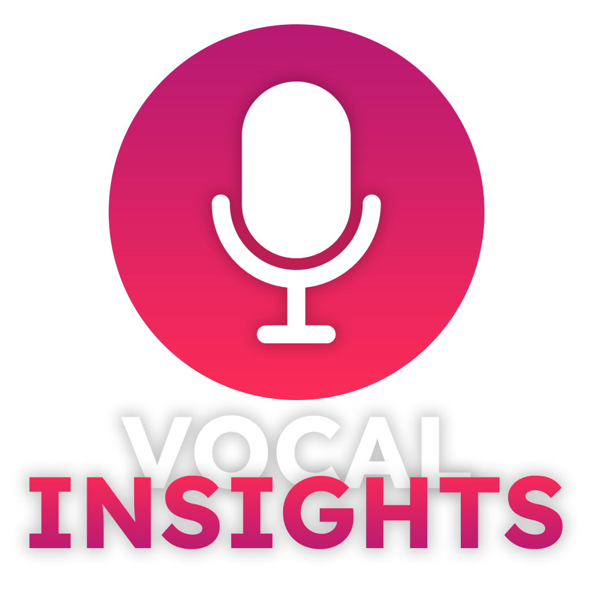

<!-- PROJECT LOGO -->
<br />
<p align="center"></p>

<div align="center">

  <p align="center">
    Summarize, Analyze, and Optimize Your Sales Calls with AI-Powered Sentiment Tracking
    <br />
    <a href="https://docs.google.com/document/d/13yhlJYMC6hXpnmm49e8UTf7jq4lbdl8qM-_jj0FV6_o/edit?usp=sharing"><strong>Explore the docs »</strong></a>
    <br />
    <br />
    <a href="https://www.youtube.com/watch?v=23vTC4eCH6Y">View Demo</a>
  </p>
</div>


<!-- TABLE OF CONTENTS -->
<details>
  <summary>Table of Contents</summary>
  <ol>
    <li>
      <a href="#about-the-project">About The Project</a>
      <ul>
        <li><a href="#built-with">Built With</a></li>
      </ul>
    </li>
    <li>
      <a href="#getting-started">Getting Started</a>
      <ul>
        <li><a href="#installation">Installation</a></li>
      </ul>
    </li>
    <li><a href="#license">License</a></li>
    <li><a href="#contact">Contact</a></li>
    <li><a href="#acknowledgments">Acknowledgments</a></li>
  </ol>
</details>


<!-- ABOUT THE PROJECT -->
## About The Project
Understanding customer sentiment and behaviour is crucial for improving sales strategies. By leveraging advanced AI and ML technologies, we aimed to create a tool that not only transcribes calls but also provides actionable insights to help sales teams better understand and engage with their customers.

### Built With
* Whisper: For natural language processing (NLP) to transcribe audio recordings.
* NLTK: For analyzing sentiment.
* Transformer models: For summarizing transcriptions
* HTML/CSS: For the front-end development.
* Flask: For the back-end development.
* AOS: For animations.
* Chart.js: For visualizing sentiment trends with interactive charts and graphs.

Throughout the development of Vocal Insights, we learned the importance of balancing accuracy and performance in AI models. We gained valuable experience in integrating multiple technologies to create a cohesive solution. This project also highlighted the potential of AI in transforming sales strategies by providing deeper insights into customer behaviour.

Looking ahead, we plan to enhance Vocal Insights by incorporating real-time sentiment analysis during live calls. We aim to refine our models further to improve accuracy and handle a wider range of accents and languages. Additionally, we plan to add more advanced analytics features, such as predictive analytics to forecast customer behaviour based on sentiment trends. Expanding the application to integrate with popular CRM systems will also be a key focus, making it easier for sales teams to incorporate Vocal Insights into their existing workflows.

<p align="right">(<a href="#readme-top">back to top</a>)</p>

<!-- GETTING STARTED -->
## Getting Started

To get a local copy up and running follow these simple example steps.

### Installation

All of the packages used for the project are located in the requirements.txt file in the repo. 

1. Create a virtual environment by running the following commands
   ```sh
   python -m venv .env
   .env/Scripts/activate
   ```
2. Install the required packages
   ```sh
   pip install -r requirements.txt
   ```

<!-- USAGE EXAMPLES -->
## Usage

Use this space to show useful examples of how a project can be used. Additional screenshots, code examples and demos work well in this space. You may also link to more resources.

<!-- LICENSE -->
## License

Distributed under the MIT License. See `LICENSE.txt` for more information.

<!-- CONTACT -->
## Contact

Sean - seann.lyj@gmail.com

Wallace - wallacekwek.business@gmail.com

Faizal - md.faizal.md.j@gmail.com


<!-- ACKNOWLEDGMENTS -->
## Acknowledgments

* [Whisper](https://github.com/openai/whisper)
* [NLTK](https://www.nltk.org/)
* [transformers](https://pypi.org/project/transformers/)
* [Flask](https://github.com/pallets/flask)
* [AOS](https://michalsnik.github.io/aos/)

<p align="right">(<a href="#readme-top">back to top</a>)</p>
